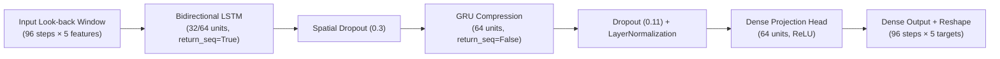

# 🛰️ GNSS Satellite Orbit & Clock Error Forecasting

[](https://www.python.org/downloads/)
[](https://tensorflow.org/)
[](https://pytorch.org/)
[](https://optuna.org/)
[](LICENSE)

An end-to-end deep learning framework for **multi-horizon forecasting of GNSS broadcast ephemeris and satellite clock errors**. The system processes 15-minute telemetry across GPS and GLONASS constellations to predict Day-8 orbital errors ($X, Y, Z$, 3D Euclidean magnitude) and atomic clock drift over multi-step horizons (15 min to 24 hours).

---

## 📌 Table of Contents

- [Overview & Motivation](#-overview--motivation)
- [Dataset & Problem Formulation](#-dataset--problem-formulation)
- [Architecture & Methodology](#-architecture--methodology)
  - [1. Production BiLSTM + GRU Model (`gnss_forecast.py`)](#1-production-bilstm--gru-model-gnss_forecastpy)
  - [2. Experimental Probabilistic Transformer (`Satellite_ML_...ipynb`)](#2-experimental-probabilistic-transformer)
  - [3. Bayesian Hyperparameter Tuning (`tune.py`)](#3-bayesian-hyperparameter-tuning-tunepy)
- [Performance & Benchmark Results](#-performance--benchmark-results)
- [Repository Structure](#-repository-structure)
- [Installation & Setup](#-installation--setup)
- [Usage Guide](#-usage-guide)
  - [Train & Evaluate Pipeline](#train--evaluate-pipeline)
  - [Hyperparameter Optimization](#hyperparameter-optimization)
  - [Google Colab Execution](#google-colab-execution)
- [Generated Visualizations & Diagnostics](#-generated-visualizations--diagnostics)
- [License](#-license)

---

## 🌌 Overview & Motivation

Global Navigation Satellite Systems (GNSS) such as **GPS** and **GLONASS** broadcast real-time ephemeris and clock correction parameters. However, broadcast data exhibits secular drift and deviations from actual orbits due to:
- Gravitational perturbations (non-spherical Earth geopotential, lunar/solar third-body effects).
- Solar radiation pressure (SRP) and atmospheric drag.
- Relativistic effects and onboard atomic clock frequency instability.

Accurate multi-step forecasting of these error vectors directly enhances **Precise Point Positioning (PPP)**, autonomous satellite navigation, and receiver tracking performance during communication blackouts.

---

## 📊 Dataset & Problem Formulation

The dataset (`FINAL_Data.csv`) contains continuous 8-day satellite tracking telemetry at **15-minute intervals** (96 epochs per day, 768 timesteps per complete satellite).

| Parameter | Specification |
| :--- | :--- |
| **Observation Cadence** | 15 minutes ($96 \text{ steps/day}$) |
| **Time Span** | 8 days (Days 1–7: Training / Validation, Day 8: Out-of-sample Test) |
| **Constellations** | GPS (PRNs starting with `G`) and GLONASS (PRNs starting with `R`) |
| **Look-back Window ($L$)** | $96\text{ steps} = 24\text{ hours}$ |
| **Forecast Horizon ($H$)** | Direct multi-step prediction of $96\text{ steps} = 24\text{ hours}$ ahead |

### Target Variables (5 Targets)

$$\mathbf{y}_t = \begin{bmatrix} \text{Error\_X}_t \\ \text{Error\_Y}_t \\ \text{Error\_Z}_t \\ \text{3D\_Orbit\_Error}_t \\ \text{Error\_Clock}_t \end{bmatrix}$$

- **$\text{Error\_X}, \text{Error\_Y}, \text{Error\_Z}$**: ECEF orbit coordinate differences between broadcast and modelled precise ephemeris ($\text{metres}$).
- **$\text{3D\_Orbit\_Error}$**: Total Euclidean spatial deviation ($\text{metres}$):
  $$\text{3D\_Orbit\_Error} = \sqrt{\text{Error\_X}^2 + \text{Error\_Y}^2 + \text{Error\_Z}^2}$$
- **$\text{Error\_Clock}$**: Satellite onboard clock bias error ($\text{seconds}$).

### Data Cleaning & Preprocessing
1. **Completeness Filtering**: Only satellites with complete 768-step sequences are retained (incomplete satellites like `G20`, `R11`, `R28` are removed to prevent sliding-window gaps).
2. **Gross Outlier Rejection**: Erroneous initialisation anomalies with $3\text{D Error} \ge 50\text{ km}$ are filtered.
3. **Leakage-Free Scaling**: A unified `StandardScaler` is fitted strictly on the Day 1–7 training partition and applied to test observations.

---

## 🧠 Architecture & Methodology

### 1. Production BiLSTM + GRU Model (`gnss_forecast.py`)

A unified multi-step neural network trained simultaneously across all operational satellites:



- **BiLSTM Layer**: Encodes both forward and backward temporal dynamics in the lookback window, capturing diurnal periodicity and drift trends.
- **GRU Bottleneck**: Condenses temporal sequences into an informative latent state with fewer parameters than stacked LSTMs.
- **Layer Normalization**: Stabilizes optimization across disparate error magnitudes between satellites and orbital planes.
- **Huber Loss Function**: Blends MSE near zero with MAE for tails, delivering robustness against non-Gaussian orbital outliers:
  $$L_\delta(y, \hat{y}) = \begin{cases} \frac{1}{2}(y - \hat{y})^2 & \text{for } |y - \hat{y}| \le \delta \\ \delta \cdot (|y - \hat{y}| - \frac{1}{2}\delta) & \text{otherwise} \end{cases}$$
- **Direct Multi-Step Forecasting**: Eliminates error accumulation inherent to autoregressive recursive rollouts.

---

### 2. Experimental Probabilistic Transformer

Implemented in PyTorch within [`Satellite_ML_Updated_Horizon_Evaluation.ipynb`](Satellite_ML_Updated_Horizon_Evaluation.ipynb):
- **Satellite Entity Embeddings**: $d_{\text{embed}}=8$ categorical PRN embeddings concatenated with kinematic features.
- **Sinusoidal Positional Encoding & Multi-Head Self-Attention**: Captures long-range orbital harmonics.
- **Context Aggregator & Future Query Decoder**: Generates 96 future token representations via cross-attention.
- **Dual Multi-Task Output Heads**:
  - **Probabilistic Head**: Outputs Gaussian distribution parameters $(\mu, \sigma)$ for calibrated epistemic/aleatoric uncertainty bands.
  - **Spike Detection Head**: Binary classification head predicting anomalous clock resets or rapid trajectory maneuvers to condition predictions.

---

### 3. Bayesian Hyperparameter Tuning (`tune.py`)

Automated hyperparameter optimization using **Optuna** over:
- `bilstm_units` $\in [32, 64, 128]$
- `gru_units` $\in [16, 32, 64]$
- `dropout_1`, `dropout_2` $\in [0.1, 0.4]$
- `learning_rate` $\in [10^{-4}, 5 \times 10^{-3}]$ (log scale)
- `batch_size` $\in [32, 64]$

---

## 📈 Performance & Benchmark Results

Evaluated on Day 8 across all valid GPS and GLONASS satellites:

### Overall Aggregate Performance (24-Hour Forecast)

| Target | Mean MAE | Mean RMSE | Units |
| :--- | :---: | :---: | :---: |
| **`Error_X`** | ~2,030.28 | ~5,458.48 | metres |
| **`Error_Y`** | ~2,048.32 | ~5,472.55 | metres |
| **`Error_Z`** | ~2,023.15 | ~5,463.05 | metres |
| **`3D_Orbit_Error`** | ~2,051.13 | ~4,428.85 | metres |
| **`Error_Clock`** | ~0.0118 | ~0.1017 | seconds |

### Multi-Horizon MAE Breakdown

| Validity Window | `Error_X` (m) | `Error_Y` (m) | `Error_Z` (m) | `3D_Orbit_Error` (m) | `Error_Clock` (s) |
| :--- | :---: | :---: | :---: | :---: | :---: |
| **15 min** (1 step) | 7,212.57 | 9,911.36 | 7,509.42 | 5,153.71 | 0.9958 |
| **30 min** (2 steps) | 3,615.66 | 4,965.88 | 3,761.46 | 2,750.38 | 0.4985 |
| **1 hour** (4 steps) | 1,815.22 | 2,490.24 | 1,899.24 | 1,502.02 | 0.2504 |
| **2 hours** (8 steps) | 2,910.63 | 3,097.55 | 2,744.54 | 2,605.92 | 0.1260 |
| **24 hours** (96 steps) | 2,030.29 | 2,048.32 | 2,023.15 | 2,051.13 | 0.0118 |

---

## 📁 Repository Structure

```text
Satellite ML/
├── gnss_forecast.py                     # Main end-to-end training, forecasting & evaluation pipeline
├── tune.py                              # Optuna hyperparameter optimization script
├── gnss_optuna.py                       # Standalone tuning script with modular pipeline
├── FINAL_Data.csv                       # 8-day 15-minute GNSS dataset (GPS + GLONASS)
├── FINAL_Data.zip                       # Compressed dataset archive
├── Run_Generation.ipynb                 # Automated execution notebook for Colab / cloud runs
├── Run_Tuning.ipynb                     # Automated Optuna tuning notebook for Colab
├── Satellite_ML_Updated_Horizon_...ipynb# PyTorch Transformer with Probabilistic & Spike heads
├── Satellite ML.ipynb                   # Exploratory analysis & baseline experimentation
└── gnss_results/                        # Saved artifacts & publication-ready diagnostic figures
    ├── gnss_model.keras                 # Serialized trained Keras model
    ├── metrics_summary.json             # Full per-satellite and aggregate evaluation metrics
    ├── 01_training_history.png          # Huber loss & MAE training/validation curves
    ├── 02_prediction_vs_actual_GPS.png  # Day-8 prediction vs actual for GPS satellites
    ├── 03_prediction_vs_actual_GLONASS.png # Day-8 prediction vs actual for GLONASS satellites
    ├── 04_multihorizon_mae_heatmap.png  # Multi-horizon error heatmap
    ├── 05_residual_distributions.png    # Residual distribution & normality verification
    └── 06_per_satellite_mae.png         # Comparative per-PRN MAE bar chart
```

---

## ⚙️ Installation & Setup

### Prerequisites
- Python 3.10 or higher
- Recommended: Virtual environment (`venv` or `conda`)
- GPU support recommended (CUDA-compatible GPU)

### 1. Clone & Set Up Environment

```bash
# Clone the repository
git clone https://github.com/KJ-CORE/Satellite_Ephemeris.git
cd Satellite_Ephemeris

# Create virtual environment
python -m venv .venv

# Activate virtual environment
# Windows (PowerShell):
.venv\Scripts\Activate.ps1
# Linux / macOS:
source .venv/bin/activate
```

### 2. Install Dependencies

```bash
pip install tensorflow torch scikit-learn pandas numpy matplotlib optuna tqdm
```

---

## 🚀 Usage Guide

### Train & Evaluate Pipeline

To run the complete data loading, sequence building, BiLSTM+GRU model training, Day-8 forecasting, and report generation:

```bash
python gnss_forecast.py --data FINAL_Data.csv --output ./gnss_results
```

**CLI Arguments:**
- `--data`: Path to input dataset CSV (default: `FINAL_Data.csv`).
- `--output`: Output directory where models, plots, and JSON metrics will be saved (default: `./gnss_results`).

---

### Hyperparameter Optimization

To find optimal network capacity, dropout rates, and learning rates with Optuna:

```bash
python tune.py --data FINAL_Data.csv
```

---

### Google Colab Execution

For fast execution using Google Colab GPUs:
1. Open [`Run_Generation.ipynb`](Run_Generation.ipynb) to download data, train the model, and export `gnss_results.zip`.
2. Open [`Run_Tuning.ipynb`](Run_Tuning.ipynb) to execute Bayesian hyperparameter optimization.

---

## 📊 Generated Visualizations & Diagnostics

All outputs generated by `gnss_forecast.py` are saved directly to `gnss_results/`:

| Artifact | Description |
| :--- | :--- |
| `01_training_history.png` | Huber loss and MAE convergence profiles over training epochs. |
| `02_prediction_vs_actual_GPS.png` | 24-hour ahead time-series overlay of predicted vs ground-truth 3D orbit and clock errors for GPS satellites. |
| `03_prediction_vs_actual_GLONASS.png` | Time-series prediction overlay for GLONASS satellites. |
| `04_multihorizon_mae_heatmap.png` | Cross-horizon error propagation heatmap (15m, 30m, 1h, 2h, 24h). |
| `05_residual_distributions.png` | Residual histogram with fitted Gaussian curves verifying zero-mean unbiased predictions. |
| `06_per_satellite_mae.png` | Comparative bar chart showing individual MAE across all evaluated PRNs. |
| `metrics_summary.json` | Comprehensive machine-readable metrics report containing per-satellite and aggregate MAE/RMSE. |

---

## 📜 License

This project is licensed under the [MIT License](LICENSE).
